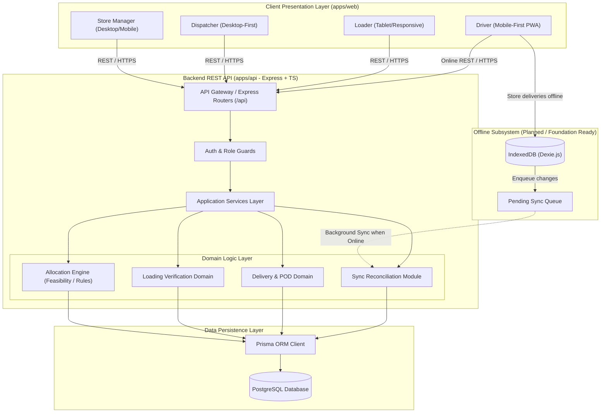

# System Architecture

## Overview

The **Waypoint Delivery Planning System** is structured as an npm workspaces monorepo separating client interfaces, backend domain logic, and shared cross-cutting contracts.

## System Topology & Flow

## Key Architectural Principles

1. **Monorepo Separation of Concerns:**
   - `packages/shared`: Shared domain enums, Zod validation schemas, and TypeScript interfaces.
   - `apps/api`: REST API built on Express, Prisma ORM, and domain services.
   - `apps/web`: React + Vite + Tailwind frontend supporting desktop and mobile layouts.
2. **Stateless Backend & Token Security:**
   - JWT-based authentication with bcrypt password hashing.
   - External inputs validated strictly via Zod.
   - Business rules isolated in service domain layers (controllers never contain allocation algorithms).
3. **Driver Offline Resilience (Planned Architecture):**
   - Driver operations store state locally in browser IndexedDB via Dexie.js.
   - Offline actions are stamped with unique `clientSyncId` tokens into a synchronization queue.
   - When connectivity is restored, records replay idempotently against `POST /api/sync`.
