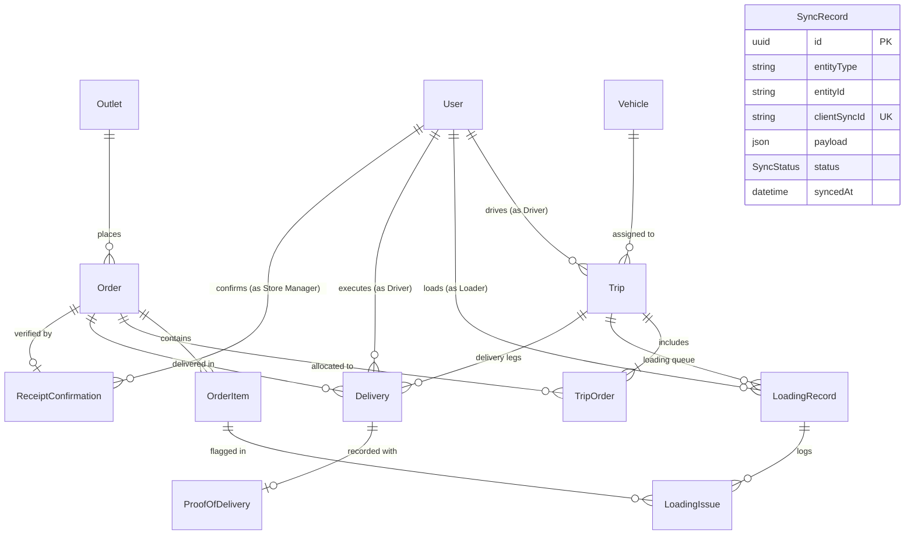

# Data Model Specification

> **Status: Initial Hackathon Data Model - subject to controlled refinement.**

This document details the core entities, relationships, and persistence attributes defined in the Prisma schema for the Waypoint Delivery Planning System.

## Entity Relationship Diagram

## Entity Descriptions

### 1. User
Represents authenticated team actors across the 4 roles: `STORE_MANAGER`, `DISPATCHER`, `LOADER`, and `DRIVER`. Stores hashed credentials (`passwordHash`) and optional depot association.

### 2. Outlet
Retail store locations receiving shipments. Captures geographical coordinates, delivery windows (`deliveryWindowStart`, `deliveryWindowEnd`), and physical accessibility restrictions (`vanOnly`).

### 3. Vehicle
Fleet delivery units. Captures `VehicleType` (`TRUCK` vs `VAN`), temperature capability `VehicleTemperatureType` (`REEFER` vs `AMBIENT`), capacities (`maxWeightKg`, `maxVolumeM3`), and weekly fuel quotas (`weeklyFuelQuotaLiters`).

### 4. Order & OrderItem
Orders placed by store managers. Each order tracks status progression, total weight and volume, requested delivery date, and deferral audit history (`deferralReason`, `deferralCount`). Order items define quantity and individual temperature requirements (`CHILLED`, `FROZEN`, `AMBIENT`).

### 5. Trip & TripOrder
Represents a planned vehicle run. A vehicle can execute a maximum of two trips per day (`tripSequenceNumber` = 1 or 2). Orders are mapped to trips via `TripOrder` with a specific sequence stop number.

### 6. LoadingRecord & LoadingIssue
Tracks warehouse loading progress (`NOT_STARTED`, `IN_PROGRESS`, `ISSUE_REPORTED`, `READY_FOR_DISPATCH`). Any damaged or missing items are recorded as `LoadingIssue` linked to specific order items.

### 7. Delivery & ProofOfDelivery
Tracks the actual delivery run by the driver to each outlet. Captures completion timestamps and links to `ProofOfDelivery` (recipient name, signature, photo URL, and timestamp).

### 8. ReceiptConfirmation
Stores formal confirmation from the Store Manager upon delivery arrival, completing the delivery workflow loop.

### 9. SyncRecord
Maintains an idempotent server-side synchronization journal for offline driver PWA sync events using unique `clientSyncId` tokens.
